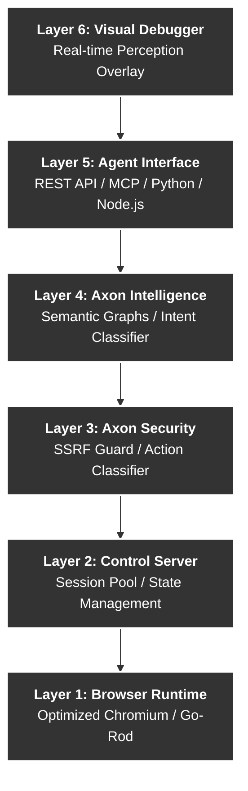

<div align="center">
  <h1>AXON</h1>
</div>

<div align="center">

**"Not a browser for humans that AI can use. A browser built for AI that humans can watch."**

[](https://github.com/rennaisance-jomt/axon)
[](https://go.dev/)
[](LICENSE)
[](docs/ARCHITECTURE.md)

[Quick Start](#quick-start) • [Benchmarks](#proven-benchmarks) • [Architecture](#architecture) • [Security](#security-first) • [Documentation](docs/)

</div>

---

## DOM is the old way of interacting with AI

Traditional browsers (Chrome, Firefox) and automation tools (Playwright, Selenium) were built for human retinas and pixels. Treating a web page as an XML document or an Accessibility Tree is the wrong abstraction for intelligence.  

**Axon is entirely different.** It is not an automation library; it is a fundamental integration layer—a sensory cortex for LLMs. It translates the chaotic visual web into a **Semantic Intent Space**.

Think of Axon as a **core LEGO block in your AI infrastructure**. It plugs seamlessly into your agent frameworks (via MCP or SDKs) and gives them native, structured understanding of the web.

---

## The Economic Reality: 98% Cost Reduction

The biggest bottleneck in AI agent adoption is API cost—spending dollars in tokens just to read a single webpage. **Axon guarantees the economic survival of agents.**

| Scenario | Standard Browser (Raw HTML) | Axon (Semantic Space) |
| :--- | :--- | :--- |
| **Summarize Hacker News** | ~50,000 tokens ($2.00) | **~150 tokens ($0.02)** |
| **Find & Post a Tweet** | ~85,000 tokens ($3.40) | **~350 tokens ($0.05)** |
| **Login to GitHub** | ~120,000 tokens ($4.80) | **~500 tokens ($0.08)** |

---

## Proven Benchmarks

Axon is fundamentally more efficient than standard browser automation. Verified against real-world targets:

| Metric | Axon Performance | Standard Headless | Result |
| :--- | :--- | :--- | :--- |
| **Token Usage** | **~100 tokens** | ~8,000+ tokens | **98% Reduction** |
| **Page Latency** | **1.2s** | 2.7s | **55.5% Faster** |
| **Boot Time** | **~15ms** | ~800ms | **Sub-50ms Sessions** |
| **Memory Footprint** | **~10MB** | ~200MB+ | **Massive Density** |

> *Benchmarks verified on Wikipedia and CNN.com (March 2026).*

---

## Under The Hood: How Axon Dominates

Standard "Agent Browsers" wrap heavy QA-testing tools like Playwright in Node.js or Python, resulting in massive dependency chains, slow boot times, and sluggish execution. 

**Axon changes the rules of the game at the lowest level:**

1. **Native C++ CDP (Zero Wrappers):** Axon is a single compiled Go binary. It speaks directly to Chromium's C++ rendering and accessibility layers. No Node.js. No Playwright. Just pure, native speed.
2. **Semantic Network Filtering:** Axon actively intercepts all network traffic at the protocol level. We drop heavy fonts (`.woff2`), images, video strings, trackers, and ad-networks *before* they ever hit browser memory. **We strip the visual web away**, making page loads virtually instantaneous.
3. **Event-Driven Auto-Waiting:** Flaky integrations use `time.Sleep()` or guess when a page is ready. Axon listens to native C++ `DOMNodeInserted` and `AnimationCanceled` rendering events. When an agent clicks a button, Axon waits synchronously at the engine level until the element is perfectly stable.
4. **Cross-Session Intent Memory:** Axon caches learned semantic relationships in an embedded database (BadgerDB). If an agent learns what the "Login" button looks like on a site today, it never has to wait for the LLM to search the DOM for it tomorrow.
5. **The Cognitive Firewall:** Before an agent even sees the DOM, Axon actively scans it for prompt injections. Actions classified as "Irreversible" (like deleting data or spending money) are dynamically quarantined for explicit agent confirmation.

---

## Comparison: How Axon Fits In

There are many great tools in the AI browser space. Here is how Axon compares to other popular approaches:

| Feature | **Axon** | **Stagehand** | **Lightpanda** | **Vercel Agent** | **Skyvern** |
| :--- | :--- | :--- | :--- | :--- | :--- |
| **Core Tech** | Go (Native) | TS/Node.js | Zig (Native) | Rust (Native) | Python/Vision |
| **Engine** | Optimized Chromium| Standard Chromium| Custom (Unique) | Headless Chrome | Computer Vision |
| **Logic** | Semantic Graphs | Hybrid/Playwright | Pure Runtime | Snapshot JSON | Visual Analysis |
| **Security** | Built-in Vault | App Layer | Sandbox | CLI-based | System-level |
| **Main Advantage** | Native Efficiency | Ease of Use | Ultra-Low RAM | Developer Speed | Adaptability |

### Key Differentiators
- **Axon vs. Vercel Agent Browser**: Vercel’s tool is a fast Rust-based CLI that focuses on snapshotting pages into JSON for LLMs. Axon goes deeper by providing a persistent, stateful engine with real-time semantic interaction and a secure credential vault.
- **Axon vs. Skyvern**: Skyvern uses computer vision to "see" and interact like a human. It's great for handling complex UI changes. Axon focuses on the underlying semantic tree, making it much faster and more token-efficient for high-volume automated tasks.
- **Axon vs. Stagehand**: Stagehand is an excellent framework wrapping Playwright. Axon is a standalone engine that replaces heavy automation libraries with a single, high-performance binary.
- **Axon vs. Lightpanda**: Lightpanda is a from-scratch Zig engine. Axon maintains total web compatibility by using a customized Chromium core while keeping resource usage extremely low.

---

## Architecture

Axon is built in pure **Go** with a unique modular architecture designed for agents:



---

## The Axon Ecosystem

Axon provides a complete toolkit to bring production-grade browser capabilities to your agents:
- **Python & Node.js SDKs**: Full-featured client libraries for rapid integration.
- **Model Context Protocol (MCP)**: Use Axon natively as a server with Claude Desktop or MCP clients.
- **Vision Debugger API**: A 60fps WebSocket overlay that lets you *watch* what your agent is thinking.
- **Axon CLI**: Manage sessions and interact with the browser directly from the terminal.

---

## The Vision: Why the AI-native web matters

Currently, AI is strapped to a browser designed for humans. We are wasting compute parsing pixels, flexboxes, and Javascript UI state. The internet is built for human consumption. Axon creates an invisible, machine-to-machine version of the internet that LLMs can naturally perceive, without losing the ability to interact with dynamic web apps. Read the full manifesto in [docs/VISION.md](docs/VISION.md).

## What Can You Build with Axon?

Because Axon makes interactions 98% cheaper and 10x more stable, entirely new agent architectures become possible:
- **Autonomous Researchers:** Agents that read thousands of pages a day to compile deep market analysis without bankrupting their creators on API tokens.
- **Social & Community Managers:** Bots that navigate Twitter, Discord, and Reddit to actively monitor sentiment, flag issues, and politely engage.
- **Financial Scrapers:** Systems that execute real-time extractions of complex financial data from highly dynamic, Javascript-heavy terminal UIs.

Read more examples in [docs/USE_CASES.md](docs/USE_CASES.md).

---

## Quick Start

### 1. Installation
Requires **Go 1.22+**.

```bash
# Clone the vault
git clone https://github.com/rennaisance-jomt/axon.git
cd axon

# Build the binary
make build
```

### 2. Launch the Engine
```bash
./bin/axon
```

### 3. Basic Session
Axon speaks pure REST. Any language can control it.

```bash
# Create a session
curl -X POST http://localhost:8020/api/v1/sessions -d '{"id": "demo"}'

# Navigate & Analyze
curl -X POST http://localhost:8020/api/v1/sessions/demo/navigate -d '{"url": "https://news.ycombinator.com"}'
curl -X POST http://localhost:8020/api/v1/sessions/demo/snapshot
```

### 4. Zero-Config LangChain Integration

Axon is designed to slip perfectly into your existing reasoning loop:

```python
from axon.langchain import AxonBrowserToolkit
from langchain.agents import initialize_agent

# Give the agent its sensory organs
tools = AxonBrowserToolkit(session="x_main").get_tools()

# Let it loose
agent = initialize_agent(tools, llm)
agent.run("Go to Hacker News, find the top AI post, and summarize the comments.")
```

---

## The Perception Shift: Death of the DOM

Standard headless tools force agents to parse miles of useless HTML or accessibility nodes. Axon collapses the web into pure semantic reality.

### Before: The Standard Way (Playwright/Puppeteer)
```html
<div class="header-nav-wrapper">
  <nav aria-label="Primary" role="navigation">
    <ul class="nav-list">
      <li class="nav-item"><a href="/new" class="nav-link" tabindex="0">new</a></li>
      <li class="nav-item"><a href="/past" class="nav-link" tabindex="0">past</a></li>
      <!-- 60,000 more characters of divs, spans, and attributes -->...
```
*Total tokens: ~8,000+. High hallucination risk. Massive API cost.*

### After: The Axon Way (Semantic Intent Space)
```text
PAGE: news.ycombinator.com | State: ready
TITLE: Hacker News

NAV:
  [n1] new [n2] past [n3] comments [n4] ask [n5] show [n6] jobs [n7] submit

FEED:
  [e1] "Show HN: Axon - An AI-native browser" (link)
  [e2] "96% token reduction is real" (link)
  [e3] "Why traditional browsers fail agents" (link)

ACTIONS:
  [a1] login (link) — auth.login
  [a2] search (textbox) — search.query
```
*Total tokens: ~85. Ready for immediate LLM reasoning.*

---

## Security First

Axon is built for the hostile web. It includes native defenses that standard automation lacks:

- **SSRF Guard**: Pre-navigation validation to prevent internal network scanning.
- **Action Reversibility**: Actions like "Delete Account" or "Post" are classified as **Irreversible** and require explicit "confirm: true".
- **Prompt Injection Scanner**: Detects malicious instructions hidden in webpage text before the agent parses it.
- **Secure Intelligence Vault**: Domain-bound credential storage that prevents agents from leaking secrets to unauthorized origins.
- **Cryptographic Audit**: Every action is hashed into an append-only, tamper-evident ledger.

---

## The Secure Intelligence Vault (BadgerVault)

Axon includes a military-grade secret vault built directly into the engine. Unlike standard browsers where agents might "see" and "leak" credentials, Axon's vault ensures secrets are only injected into the correct domains.

- **Domain Binding**: A secret for `github.com` cannot be used on `evil-phish.com`, even if the agent is tricked.
- **Physical Masking**: Credentials injected into the DOM are physically masked (rendered as `******`) from visual snapshots and stream replays.
- **Encrypted at Rest**: All secrets are stored in an AES-256-GCM encrypted local database.

---

## 📚 Deep Dives

| Guide | Description |
| :--- | :--- |
| [**The Vision**](docs/VISION.md) | Why the AI-native web matters for the future. |
| [**Real-World Use Cases**](docs/USE_CASES.md) | What agents can actually *do* with Axon. |
| [**Getting Started**](docs/GETTING_STARTED.md) | Step-by-step installation and first session. |
| [**Architecture**](docs/ARCHITECTURE.md) | Deep technical dive into the 5-layer stack. |
| [**API Reference**](docs/API_SPEC.md) | Full REST API specification. |
| [**Security Model**](docs/SECURITY.md) | How we keep your agents (and data) safe. |

---

<div align="center">

*Axon Project | 2026*  
*An AI-native browser built with  for AI agents.*

</div>

